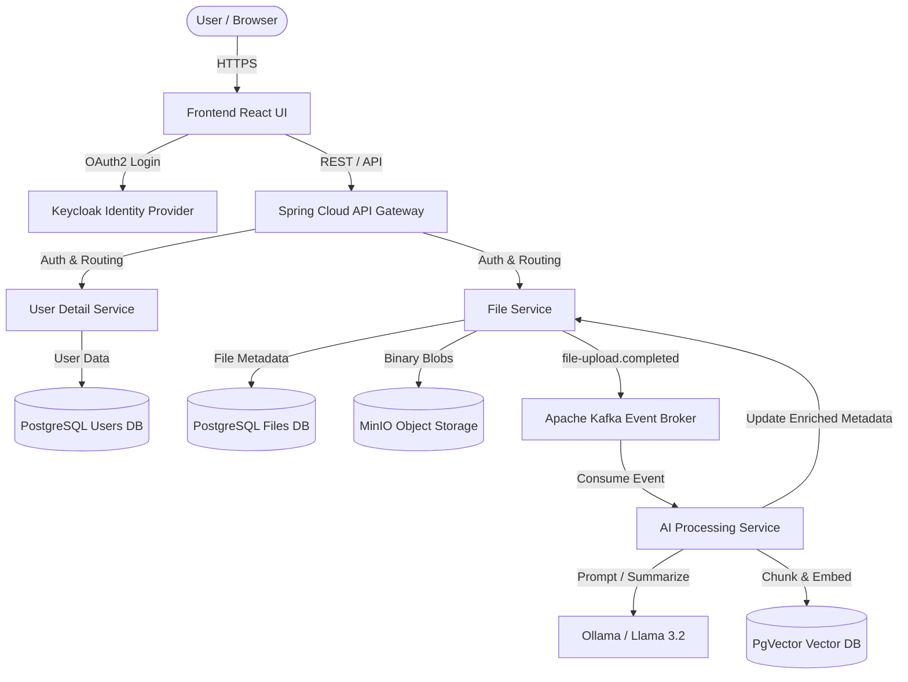

# 🚀 AI-Powered Document Management System (EDMS)


An enterprise-grade, microservices-based Electronic Document Management System (EDMS) engineered with **Spring Boot**, **React**, and **Apache Kafka**. This platform introduces an intelligent **AI Processing Pipeline** that automatically enriches uploaded documents with AI-generated summaries, intelligent tagging, and semantic vector embeddings, allowing users to execute "Chat with your Document" queries via **Retrieval-Augmented Generation (RAG)**.

---

## 🌟 Key Features

* **Event-Driven Architecture**: Fully asynchronous document processing pipeline decoupled via **Apache Kafka**.
* **AI Document Chat (RAG)**: Uses **Spring AI**, **PgVector**, and **Ollama (Llama 3.2)** to generate semantic embeddings. Users can ask questions about their files and receive context-aware answers.
* **Auto-Enrichment**: Every uploaded document is automatically analyzed by the AI to generate a concise summary, sensitivity classification, and relevant metadata tags.
* **Enterprise Security (OAuth 2.0)**: Centralized authentication, RBAC (Role-Based Access Control), and SSO handled by **Keycloak** and **Spring Security**.
* **Distributed Storage**: Binary files are securely persisted using **MinIO** (S3-compatible object storage), while metadata is split across isolated **PostgreSQL** microservice databases.
* **Modern Premium UI**: A beautiful, fully animated **Glassmorphism** React frontend with a custom integrated Keycloak login portal.

---

## 🏛️ System Architecture & Data Flow

The platform relies on a strict microservice ecosystem. The **API Gateway** serves as the single entry point, handling JWT validation and routing. Services communicate synchronously via REST and asynchronously via Kafka events.



---

## 🛠️ Technology Stack

### Backend / Microservices
* **Java 21 & Spring Boot 3.2**: Core framework for all microservices.
* **Spring Cloud Gateway**: Reverse proxy and API routing.
* **Spring Security & OAuth2 Resource Server**: Token validation and RBAC.
* **Spring AI**: Unified interface for AI model interaction and vector store abstraction.
* **Apache Kafka**: Message broker handling `file-upload.completed` events.
* **Flyway**: Database migration and versioning.

### Frontend
* **React & Vite**: Blazing fast modern frontend build tool.
* **React Router**: Client-side routing.
* **Custom CSS Glassmorphism**: High-performance, animated UI styling.

### Infrastructure & Storage
* **Docker & Docker Compose**: Complete local environment orchestration.
* **PostgreSQL (pgvector)**: Relational data and high-dimensional vector embeddings.
* **MinIO**: S3-compatible, high-performance distributed object storage.
* **Keycloak**: Open-source identity and access management.

---

## ⚙️ How the AI Pipeline Works (Step-by-Step)

1. **Upload:** A user securely uploads a document (e.g., PDF, TXT) through the React frontend.
2. **Storage:** The `FileService` saves the binary blob to MinIO, saves initial metadata to Postgres, and fires a `file-upload.completed` event to Kafka.
3. **Consumption:** The `AIProcessingService` consumes the Kafka event, downloads the file content using a secure service-to-service Machine token, and triggers the AI pipeline.
4. **Enrichment:** The service prompts the local Ollama LLM to generate a summary, sensitivity level, and tags, which are immediately sent back to `FileService` via REST.
5. **Vectorization:** The document is split into overlapping chunks using a `TokenTextSplitter`. These chunks are converted into dense vector embeddings and stored in `pgvector`.
6. **RAG Querying:** When a user queries a document, the system calculates the semantic similarity of the question against the vector database, extracts the top-K relevant chunks, and injects them into a strict prompt for the LLM to generate an accurate, hallucination-free answer.

---

## 🚀 Getting Started (Local Deployment)

### Prerequisites
* **Docker & Docker Desktop** (with plenty of allocated RAM for AI models).
* **Python 3** (for the automated startup script).
* **Ollama** installed locally with the `llama3.2` and `nomic-embed-text` models pulled.
  ```bash
  ollama run llama3.2
  ollama pull nomic-embed-text
  ```

### Startup Instructions

We use a unified Python launcher to start the infrastructure and all Java/React microservices simultaneously.

1. **Clone the repository:**
   ```bash
   git clone https://github.com/Khantawfeek00/AI-Document-Management-System.git
   cd AI-Document-Management-System
   ```

2. **Run the automated startup script:**
   ```bash
   python run_all.py
   ```
   *This script will automatically boot up Postgres, Kafka, MinIO, and Keycloak in Docker. It will then compile and launch the API Gateway, FileService, UserDetailService, AIProcessingService, and the Vite Frontend.*

3. **Access the Application:**
   * **Frontend Portal:** [http://localhost:5173](http://localhost:5173)
   * **Keycloak Admin:** [http://localhost:9090/admin](http://localhost:9090/admin) (Username: `admin` / Password: `admin`)
   * **MinIO Console:** [http://localhost:9001](http://localhost:9001)

### Default User Accounts
Keycloak is pre-populated with several test accounts depending on your realm configuration. To manage users, log into the Keycloak Admin console and navigate to the `file-management` realm -> Users.

---

## 🔒 Security & RBAC

The system employs **Role-Based Access Control (RBAC)** across all microservices:
* **`default-roles-file-management`**: Baseline user permissions (upload, view own files, query AI).
* **`manager`**: Elevated permissions for viewing organizational trends.
* **`admin`**: Full access to the UserDetailService for managing platform roles.
* **Service Accounts**: Microservices authenticate with each other (e.g., `AIProcessingService` -> `FileService`) using `client_credentials` grants to obtain temporary Machine-to-Machine JWTs.
